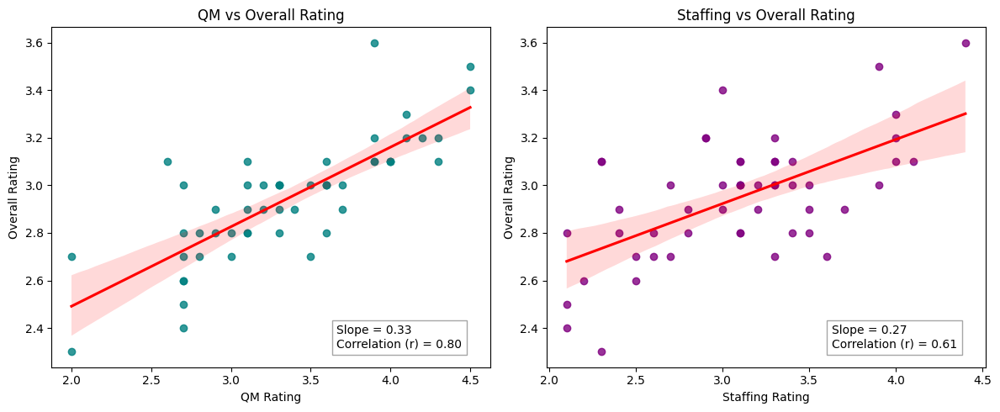
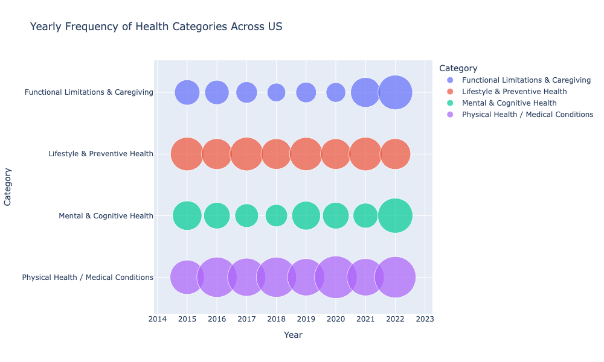
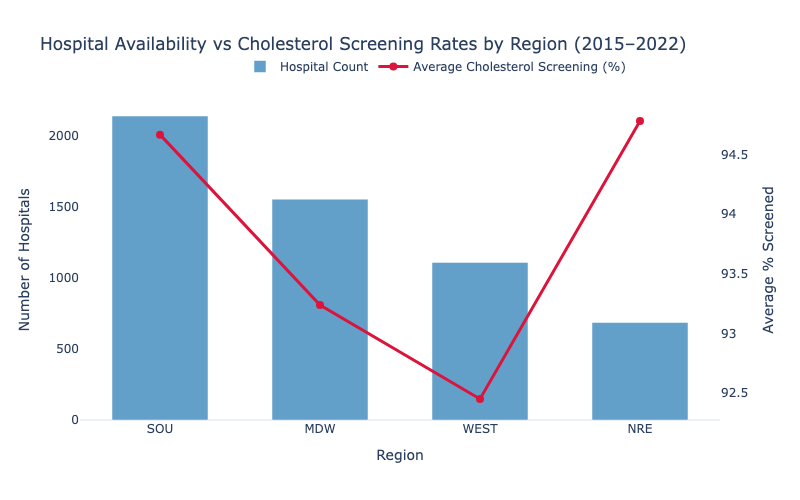
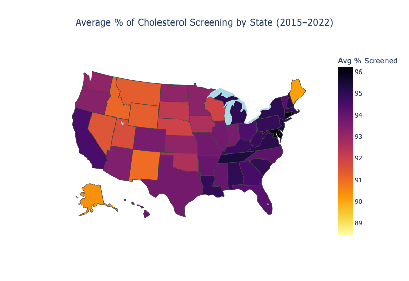

# State-Level-Analysis-of-Health-Issues-Hospital-Availability-and-Healthcare-Quality-in-the-U.S.

## 👥 Team Members
- Suji Kim (Project Manager)
- Anna Baldzikowski
- Linh Le
- Shi Qiu
- Tianqi Sun
- Xiaoyan Wang

## 📊 Executive Summary
As the U.S. population ages, ensuring that older adults have equitable access to high-quality healthcare has become an urgent priority. Integrating health, hospital, and nursing home rating data from the CDC, the U.S. Government Works, and CMS, this project analyzes state/region-level patterns in access, quality, and health status across the United States. We aim to provide strategic insights for policymakers and providers to improve resource allocation and patient outcomes.

Key findings include that states such as Texas and Ohio show high accessibility, with more long-term care hospitals per elderly population, yet this does not always correspond to better service quality. A regression model (R² = 0.909) identified Quality Measure (QM) as the strongest predictor of overall nursing home performance, suggesting that care quality relies more on operations than facility count. In high-performing states, 76.5-81.7% of older adults report good or excellent health, with 8.3-10.6% experiencing frequent mental distress. In contrast, low-performing states show 69.7-77.7% good or excellent health and 9.2-13.4% distress. Regionally, the South has the largest hospital network (>2,000 facilities) and cholesterol screening rates above 94%, while the Northeast has fewer hospitals, and the rural West shows the lowest screening rates.

Overall, this study visualized key health indicators through diverse charts and maps (box plots, linear regression scatter plots, and Choropleth maps), revealing the need to balance quantitative expansion with qualitative management of healthcare infrastructure. These insights emphasize that improving both capacity and service quality is essential for promoting healthier aging and effective policy prioritization nationwide.

## 📈 Key Visualizations

### 1️⃣ <QM vs. Overall> vs. <Staffing vs. Overall>

### 2️⃣ Yearly Frequency of Health Categories Across US

### 3️⃣ Hospital Availability vs. Cholesterol Screening Rates by Region (2015-2022)

### 4️⃣ Average % of Cholesterol Screening by State (2015-2022)

